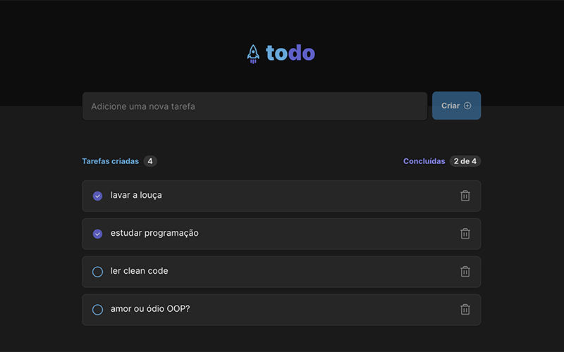
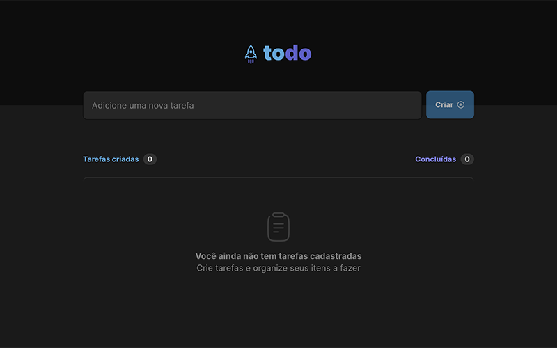

# toDo
A simple to do application
- Built with React, Typescript and Vite.
- Styles with Sass and CSS Modules
- Didn't use a state management library. Lots of prop drilling ;)
 
 
<a href="#">Demo on Vercel</a>
 
 

